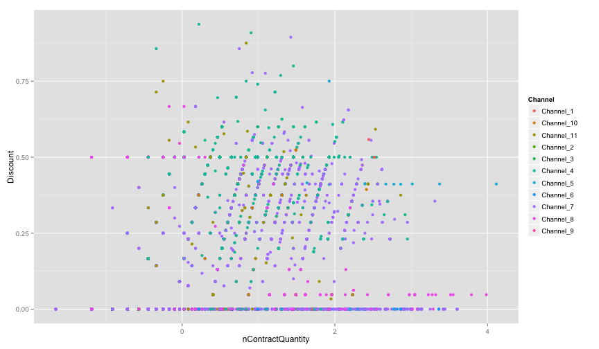
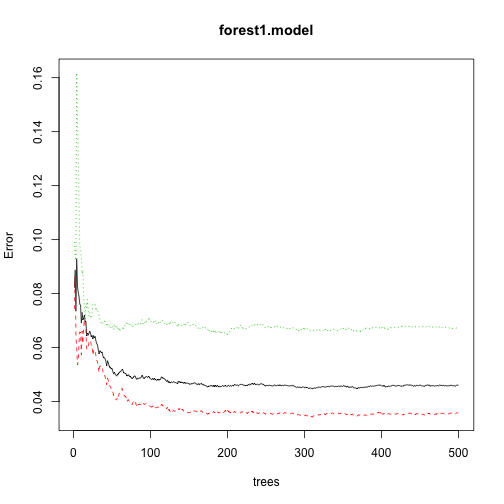

Customized Pricing v5 analysis
========================================================

Initilize R environment
-------------------------

Set language and load relevant packages.

```r
Sys.setenv(LANG = "en")

require("plyr")
require("ggplot2")
```


Preparing data for analysis
---------------------------

First set the working directory [NOTE: you need to modify the path below to the actual folder having the data file]. Then read the csv data files and have a quick look

```r
#NEED TO FIRST SET R WORKING DIRECTORY TO WHERE THE FILES ARE LOCATED!!!
#setwd("~/PATH/TO/DATA/FILE")

dataT <- read.csv("../data/data.v5.masked.Training.csv", header=TRUE)
dataV <- read.csv("../data/data.v5.masked.Validation.csv", header=TRUE)
levels(dataV$Territory) = levels(dataT$Territory)

head(dataT, n=10)
```

```
   PricingDate     Product      Customer    Channel     Territory ContractQuantity InvoicePrice InvoiceAmount NetPrice NetAmount Discount isDiscount
1    12-OCT-12  Product_94  Customer_999  Channel_4  Territory_11               30         70.0        2100.0     70.0      2100   0.0000      FALSE
2    18-SEP-12  Product_27 Customer_1623  Channel_8 Territory_111               30         51.7        1551.0     51.7      1551   0.0000      FALSE
3    07-SEP-12  Product_52 Customer_1832  Channel_7  Territory_15                2         40.0          80.0     40.0        80   0.0000      FALSE
4    14-AUG-12  Product_98  Customer_596  Channel_8  Territory_45               20         39.0         780.0     39.0       780   0.0000      FALSE
5    03-SEP-12 Product_122  Customer_837  Channel_4  Territory_27               18         90.0        1620.0     50.0       900   0.4444       TRUE
6    04-JUL-12 Product_135  Customer_464  Channel_7  Territory_33               20         13.0         260.0     13.0       260   0.0000      FALSE
7    24-SEP-12  Product_32 Customer_1356 Channel_11  Territory_25                7        108.5         759.5     62.0       434   0.4286       TRUE
8    21-NOV-12 Product_102  Customer_230  Channel_8  Territory_94               20          7.1         142.0      7.1       142   0.0000      FALSE
9    27-AUG-12 Product_122   Customer_33 Channel_11  Territory_25               60         90.0        5400.0     60.0      3600   0.3333       TRUE
10   14-NOV-12 Product_123 Customer_1752  Channel_7  Territory_29                1         40.0          40.0     40.0        40   0.0000      FALSE
   nContractQuantity nInvoicePrice
1             0.6439      0.271735
2             0.6439     -0.000312
3            -1.1864     -0.230651
4             0.3699     -0.253379
5             0.2987      0.497348
6             0.3699     -1.239639
7            -0.3397      0.665170
8             0.3699     -1.782636
9             1.1124      0.497348
10           -1.6549     -0.230651
```


Visualize the Training data set:
- distribution of *Discount* (taken out those cases with 0 discount)

```r
hist(dataT[dataT$isDiscount,]$Discount, breaks=50)
```

 


- plot *Discount* as a function of *nContractQuantity*, colored by *Channel*

```r
qplot(x=nContractQuantity, y=Discount, colour=Channel, data=dataT)
```

 


Analysis Step 1. Classification
--------------------------------
To predict whom not to offer any discount. Here we will test multiple classification tools using the **Training** dataset: logistic regression, decision tree, random forest, and SVM, and choose the best.

# 1. logistic regression without using *Territory* variable.

- Setup and train the model

```r
logistic1.model <- glm(isDiscount ~ nContractQuantity + nInvoicePrice + Channel, data=dataT, family=binomial())

summary(logistic1.model)
```

```

Call:
glm(formula = isDiscount ~ nContractQuantity + nInvoicePrice + 
    Channel, family = binomial(), data = dataT)

Deviance Residuals: 
   Min      1Q  Median      3Q     Max  
-3.181  -0.491  -0.210   0.519   4.409  

Coefficients:
                  Estimate Std. Error z value Pr(>|z|)    
(Intercept)        -1.0456     0.6610   -1.58    0.114    
nContractQuantity   1.9262     0.0319   60.30  < 2e-16 ***
nInvoicePrice       0.7149     0.0258   27.76  < 2e-16 ***
ChannelChannel_10  -0.1093     0.6718   -0.16    0.871    
ChannelChannel_11   0.7510     0.6649    1.13    0.259    
ChannelChannel_2   -9.5839    97.7185   -0.10    0.922    
ChannelChannel_3   -5.8945     1.0160   -5.80  6.6e-09 ***
ChannelChannel_4    1.1831     0.6620    1.79    0.074 .  
ChannelChannel_5   -5.6797     0.7779   -7.30  2.9e-13 ***
ChannelChannel_6   -7.8762     1.2089   -6.52  7.3e-11 ***
ChannelChannel_7    0.2700     0.6617    0.41    0.683    
ChannelChannel_8   -2.6252     0.6643   -3.95  7.8e-05 ***
ChannelChannel_9    2.4005     1.2427    1.93    0.053 .  
---
Signif. codes:  0 '***' 0.001 '**' 0.01 '*' 0.05 '.' 0.1 ' ' 1

(Dispersion parameter for binomial family taken to be 1)

    Null deviance: 24022  on 19001  degrees of freedom
Residual deviance: 13648  on 18989  degrees of freedom
AIC: 13674

Number of Fisher Scoring iterations: 10
```


- Validation using the **Validation** dataset: Predict *True* if the prob > 0.5, then count accuracy using the *table* function.

```r
logistic1.valid <- dataV[c("Channel", "nContractQuantity", "nInvoicePrice", "Discount", "isDiscount")]
logistic1.valid$predP <- predict(logistic1.model, newdata=logistic1.valid, type="response")
logistic1.valid$pred1 <- logistic1.valid$predP>0.5

logistic1.table <- table(logistic1.valid$pred1, logistic1.valid$isDiscount)
logistic1.table
```

```
       
        FALSE TRUE
  FALSE  4850  765
  TRUE    612 1918
```


# 2. Logistic regression with *Territory* variable.
- Setup and train the model

```r
logistic2.model <- glm(isDiscount ~ nContractQuantity + nInvoicePrice + Channel + Territory, data=dataT, family=binomial())

summary(logistic2.model)
```

```

Call:
glm(formula = isDiscount ~ nContractQuantity + nInvoicePrice + 
    Channel + Territory, family = binomial(), data = dataT)

Deviance Residuals: 
   Min      1Q  Median      3Q     Max  
-3.321  -0.398  -0.085   0.380   4.150  

Coefficients:
                        Estimate Std. Error z value Pr(>|z|)    
(Intercept)              -1.2063     0.8316   -1.45  0.14687    
nContractQuantity         2.2342     0.0400   55.92  < 2e-16 ***
nInvoicePrice             0.8710     0.0329   26.44  < 2e-16 ***
ChannelChannel_10         1.8274     0.9294    1.97  0.04926 *  
ChannelChannel_11         0.6947     0.8017    0.87  0.38620    
ChannelChannel_2         -9.6824  3228.7418    0.00  0.99761    
ChannelChannel_3         -6.6024     1.1442   -5.77  7.9e-09 ***
ChannelChannel_4          1.3169     0.7971    1.65  0.09849 .  
ChannelChannel_5         -3.6490     1.0443   -3.49  0.00048 ***
ChannelChannel_6        -19.3690   535.3239   -0.04  0.97114    
ChannelChannel_7          1.1817     0.8041    1.47  0.14167    
ChannelChannel_8         -0.0690     0.9292   -0.07  0.94082    
ChannelChannel_9          1.9336     1.3340    1.45  0.14720    
TerritoryTerritory_10     0.3251     0.3221    1.01  0.31282    
TerritoryTerritory_100  -19.7149  1692.2779   -0.01  0.99070    
TerritoryTerritory_101  -18.5942  6522.6386    0.00  0.99773    
TerritoryTerritory_102  -18.4707  2120.2006   -0.01  0.99305    
TerritoryTerritory_103   -0.3547     0.3276   -1.08  0.27894    
TerritoryTerritory_104  -19.2357  2151.7262   -0.01  0.99287    
TerritoryTerritory_105  -19.3431   794.3994   -0.02  0.98057    
TerritoryTerritory_106   -3.2595  3905.5584    0.00  0.99933    
TerritoryTerritory_107  -18.6251   748.8301   -0.02  0.98016    
TerritoryTerritory_108   -1.9017     0.4455   -4.27  2.0e-05 ***
TerritoryTerritory_109  -20.7511  1524.2786   -0.01  0.98914    
TerritoryTerritory_11     0.0726     0.3342    0.22  0.82801    
TerritoryTerritory_110    0.2981     0.6741    0.44  0.65835    
TerritoryTerritory_111   -5.3330     0.6026   -8.85  < 2e-16 ***
TerritoryTerritory_112   -1.1205     0.4994   -2.24  0.02487 *  
TerritoryTerritory_113   -1.0372     0.6978   -1.49  0.13720    
TerritoryTerritory_12    -1.7218     0.6025   -2.86  0.00426 ** 
TerritoryTerritory_13    -0.2921  3555.6540    0.00  0.99993    
TerritoryTerritory_14     0.3275     0.3310    0.99  0.32251    
TerritoryTerritory_15    -6.5448     0.4110  -15.92  < 2e-16 ***
TerritoryTerritory_16     0.2481     0.3313    0.75  0.45400    
TerritoryTerritory_17     0.0936     0.3275    0.29  0.77510    
TerritoryTerritory_18   -17.5497  1175.3462   -0.01  0.98809    
TerritoryTerritory_19    -0.4462     0.2449   -1.82  0.06845 .  
TerritoryTerritory_2     -1.3773     0.3917   -3.52  0.00044 ***
TerritoryTerritory_20   -18.1260  4557.8691    0.00  0.99683    
TerritoryTerritory_21     0.0938     0.3484    0.27  0.78770    
TerritoryTerritory_22    -0.0764     0.3182   -0.24  0.81020    
TerritoryTerritory_23     0.1653     0.2887    0.57  0.56706    
TerritoryTerritory_24   -16.7655  2602.2358   -0.01  0.99486    
TerritoryTerritory_25     0.4414     0.2692    1.64  0.10107    
TerritoryTerritory_26     0.3750     0.2797    1.34  0.18003    
TerritoryTerritory_27     0.4708     0.2803    1.68  0.09302 .  
TerritoryTerritory_28    -0.3349     0.2419   -1.38  0.16619    
TerritoryTerritory_29    -0.0589     0.2383   -0.25  0.80490    
TerritoryTerritory_3     -1.2567     0.5790   -2.17  0.02998 *  
TerritoryTerritory_30    -1.6479     0.6151   -2.68  0.00738 ** 
TerritoryTerritory_31    -0.3654     0.2490   -1.47  0.14226    
TerritoryTerritory_32    -2.5062     0.2515   -9.96  < 2e-16 ***
TerritoryTerritory_33     0.0717     0.2474    0.29  0.77208    
TerritoryTerritory_34     0.0230     0.3262    0.07  0.94375    
TerritoryTerritory_35    -0.2708     0.2413   -1.12  0.26166    
TerritoryTerritory_36   -14.7309  1400.6127   -0.01  0.99161    
TerritoryTerritory_37     0.2066     0.4932    0.42  0.67533    
TerritoryTerritory_38    -0.1560     0.2362   -0.66  0.50891    
TerritoryTerritory_39    -0.5560     0.3201   -1.74  0.08242 .  
TerritoryTerritory_4    -18.3075  1427.2436   -0.01  0.98977    
TerritoryTerritory_40     0.7268     0.4534    1.60  0.10898    
TerritoryTerritory_41   -17.5697   644.2042   -0.03  0.97824    
TerritoryTerritory_42   -18.7895   622.4226   -0.03  0.97592    
TerritoryTerritory_43    -1.8274  1497.5242    0.00  0.99903    
TerritoryTerritory_44    -0.1761  1751.3311    0.00  0.99992    
TerritoryTerritory_45    -2.0873     0.5456   -3.83  0.00013 ***
TerritoryTerritory_46   -17.3656  2266.6448   -0.01  0.99389    
TerritoryTerritory_47   -17.9819  6522.6386    0.00  0.99780    
TerritoryTerritory_48   -18.7482  3540.7131   -0.01  0.99578    
TerritoryTerritory_49     0.7639     0.3306    2.31  0.02086 *  
TerritoryTerritory_5     -2.1890     0.5697   -3.84  0.00012 ***
TerritoryTerritory_50    -3.0255     0.5598   -5.40  6.5e-08 ***
TerritoryTerritory_51   -16.8547   700.0053   -0.02  0.98079    
TerritoryTerritory_52     0.5474     0.3781    1.45  0.14768    
TerritoryTerritory_53    -0.6556     0.3200   -2.05  0.04051 *  
TerritoryTerritory_54     0.1196     0.2963    0.40  0.68642    
TerritoryTerritory_55    -2.5084     1.1546   -2.17  0.02981 *  
TerritoryTerritory_56   -17.7055  1664.7913   -0.01  0.99151    
TerritoryTerritory_57    -3.8308     0.6858   -5.59  2.3e-08 ***
TerritoryTerritory_58   -18.8897   593.7360   -0.03  0.97462    
TerritoryTerritory_59   -17.5194  1729.9930   -0.01  0.99192    
TerritoryTerritory_6    -17.7668  1000.8137   -0.02  0.98584    
TerritoryTerritory_60    -3.1047  1402.6841    0.00  0.99823    
TerritoryTerritory_61   -18.3951   637.6545   -0.03  0.97699    
TerritoryTerritory_62   -18.2855  1773.4265   -0.01  0.99177    
TerritoryTerritory_63     0.7132     0.3871    1.84  0.06538 .  
TerritoryTerritory_64     1.5659  1569.8466    0.00  0.99920    
TerritoryTerritory_65   -17.5998   564.3258   -0.03  0.97512    
TerritoryTerritory_66   -18.2307   769.6978   -0.02  0.98110    
TerritoryTerritory_67    -0.0147     0.3555   -0.04  0.96705    
TerritoryTerritory_68    -2.0870     0.9008   -2.32  0.02051 *  
TerritoryTerritory_69   -17.4679   575.8220   -0.03  0.97580    
TerritoryTerritory_7    -17.1491  6522.6386    0.00  0.99790    
TerritoryTerritory_70    -2.7538     0.7165   -3.84  0.00012 ***
TerritoryTerritory_71    -0.2316     0.4982   -0.46  0.64206    
TerritoryTerritory_72     1.5719     0.6885    2.28  0.02243 *  
TerritoryTerritory_73   -18.0649  1423.1417   -0.01  0.98987    
TerritoryTerritory_74    -3.6802     1.2274   -3.00  0.00271 ** 
TerritoryTerritory_75    -1.1273     0.5543   -2.03  0.04196 *  
TerritoryTerritory_76     0.1385  6544.5692    0.00  0.99998    
TerritoryTerritory_77     1.5326  1695.5608    0.00  0.99928    
TerritoryTerritory_78     0.6566     0.4240    1.55  0.12153    
TerritoryTerritory_79     0.2701     0.3522    0.77  0.44317    
TerritoryTerritory_8      0.0476     0.5967    0.08  0.93639    
TerritoryTerritory_80    -0.2828  2281.5036    0.00  0.99990    
TerritoryTerritory_81   -17.1366  2434.5462   -0.01  0.99438    
TerritoryTerritory_82    -0.0103     0.3345   -0.03  0.97543    
TerritoryTerritory_83     0.6787  1945.4580    0.00  0.99972    
TerritoryTerritory_84    -4.5645  6544.5692    0.00  0.99944    
TerritoryTerritory_85   -18.5462   688.5654   -0.03  0.97851    
TerritoryTerritory_86   -15.5893  6522.6386    0.00  0.99809    
TerritoryTerritory_87   -17.3311  1410.0258   -0.01  0.99019    
TerritoryTerritory_88     0.2055     0.3238    0.63  0.52564    
TerritoryTerritory_89   -20.0665  3225.9080   -0.01  0.99504    
TerritoryTerritory_9     -0.2064     0.6201   -0.33  0.73928    
TerritoryTerritory_90    -1.8989     0.5749   -3.30  0.00096 ***
TerritoryTerritory_91    -0.0782     0.3639   -0.21  0.82982    
TerritoryTerritory_92     0.3765     0.2536    1.48  0.13767    
TerritoryTerritory_93   -18.0744   740.4881   -0.02  0.98053    
TerritoryTerritory_94    -1.5946     0.5688   -2.80  0.00506 ** 
TerritoryTerritory_95    13.5472   535.3241    0.03  0.97981    
TerritoryTerritory_96   -18.4861  3613.3849   -0.01  0.99592    
TerritoryTerritory_97    -0.0271     0.2912   -0.09  0.92592    
TerritoryTerritory_98   -17.2419   784.8222   -0.02  0.98247    
TerritoryTerritory_99    -2.2429     0.9024   -2.49  0.01294 *  
---
Signif. codes:  0 '***' 0.001 '**' 0.01 '*' 0.05 '.' 0.1 ' ' 1

(Dispersion parameter for binomial family taken to be 1)

    Null deviance: 24022  on 19001  degrees of freedom
Residual deviance: 11250  on 18877  degrees of freedom
AIC: 11500

Number of Fisher Scoring iterations: 17
```


- Validation using the **Validation** dataset: Predict *True* if the prob > 0.5, then count accuracy using the *table* function.

```r
logistic2.valid <- dataV[c("Channel", "Territory", "nContractQuantity", "nInvoicePrice", "Discount", "isDiscount")]
logistic2.valid$predP <- predict(logistic2.model, newdata=logistic2.valid, type="response")
logistic2.valid$pred1 <- logistic2.valid$predP>0.5

logistic2.table <- table(logistic2.valid$pred1, logistic2.valid$isDiscount)
logistic2.table
```

```
       
        FALSE TRUE
  FALSE  4764 1153
  TRUE    698 1530
```


- Plot the ROC and accuracy curves.

```r
require(ROCR)
logistic2.pred <- prediction(logistic2.valid$predP, logistic2.valid$isDiscount)
# Plot ROC curve
logistic2.ROC <- performance(logistic2.pred, measure = "tpr", x.measure = "fpr")
plot(logistic2.ROC)
```

 

```r
# Plot precision/recall curve
#logistic2.precision <- performance(logistic2.pred, measure = "prec", x.measure = "rec")
#plot(logistic2.precision)
# Plot accuracy as function of threshold
logistic2.accuracy <- performance(logistic2.pred, measure = "acc")
plot(logistic2.accuracy)
```

 


# 3. Decision tree using the *rpart* package.
- Setup and train the model, then print summary.

```r
require("rpart")
tree2.model <- rpart(as.factor(isDiscount) ~ nContractQuantity + nInvoicePrice + Channel + Territory, data=dataT)
summary(tree2.model)
```

```
Call:
rpart(formula = as.factor(isDiscount) ~ nContractQuantity + nInvoicePrice + 
    Channel + Territory, data = dataT)
  n= 19002 

       CP nsplit rel error xerror     xstd
1 0.32478      0    1.0000 1.0000 0.010406
2 0.01529      2    0.3504 0.3516 0.007076
3 0.01319      9    0.2370 0.2404 0.005970
4 0.01000     10    0.2238 0.2322 0.005875

Variable importance
nContractQuantity         Territory     nInvoicePrice           Channel 
               30                30                20                20 

Node number 1: 19002 observations,    complexity param=0.3248
  predicted class=FALSE  expected loss=0.3271  P(node) =1
    class counts: 12787  6215
   probabilities: 0.673 0.327 
  left son=2 (9257 obs) right son=3 (9745 obs)
  Primary splits:
      nContractQuantity < -0.06641  to the left,  improve=2799.0, (0 missing)
      Territory         splits as  LRLLLRLLLLLLRRLRLLLRLRRLRLLRRRLRRRRRRRRLRRRLRRRLRLLLLLLLLRLLLRRRLLLLLLLLLRLLLRRLLLRRLLRLLRRRLLRLLLLLRLLLRRLLLLRLL, improve=2057.0, (0 missing)
      Channel           splits as  RLRLLRLLLLR, improve=1202.0, (0 missing)
      nInvoicePrice     < 0.9469    to the right, improve= 308.7, (0 missing)
  Surrogate splits:
      Territory     splits as  LRLLLRLLRRRRRLRRLLRRLRRLLLLRRRLRRRRLRRRLLRRRRLRLRLLRRLLLLRLLLRRRRRRLLLRLLRLLLRLLLRRRLRRLLRRRRLRRRLRLRLLRRRLLRLRLR, agree=0.663, adj=0.308, (0 split)
      Channel       splits as  RRRRRRRRLLR, agree=0.615, adj=0.209, (0 split)
      nInvoicePrice < 0.6726    to the right, agree=0.610, adj=0.200, (0 split)

Node number 2: 9257 observations
  predicted class=FALSE  expected loss=0.04861  P(node) =0.4872
    class counts:  8807   450
   probabilities: 0.951 0.049 

Node number 3: 9745 observations,    complexity param=0.3248
  predicted class=TRUE   expected loss=0.4084  P(node) =0.5128
    class counts:  3980  5765
   probabilities: 0.408 0.592 
  left son=6 (3044 obs) right son=7 (6701 obs)
  Primary splits:
      Territory         splits as  LR---RLLLLRLRRLRRLLRLRRLRL-RRRLRRRRRRRRLRRRLRRR-RLLLLL---RLLLRRRLLLLLLLL-RLLLRRL-LRRLLR-LRRRL-RLLLL-RL-LRRLLL-RLL, improve=1886.00, (0 missing)
      Channel           splits as  RRRLLRLLRLR, improve=1266.00, (0 missing)
      nInvoicePrice     < 0.3331    to the left,  improve= 480.00, (0 missing)
      nContractQuantity < 0.05166   to the left,  improve=  75.18, (0 missing)
  Surrogate splits:
      Channel           splits as  RRRLRRLLRLR, agree=0.890, adj=0.648, (0 split)
      nInvoicePrice     < -1.466    to the left,  agree=0.730, adj=0.134, (0 split)
      nContractQuantity < 2.379     to the right, agree=0.693, adj=0.017, (0 split)

Node number 6: 3044 observations
  predicted class=FALSE  expected loss=0.1301  P(node) =0.1602
    class counts:  2648   396
   probabilities: 0.870 0.130 

Node number 7: 6701 observations,    complexity param=0.01529
  predicted class=TRUE   expected loss=0.1988  P(node) =0.3526
    class counts:  1332  5369
   probabilities: 0.199 0.801 
  left son=14 (4115 obs) right son=15 (2586 obs)
  Primary splits:
      nInvoicePrice     < 0.315     to the left,  improve=192.60, (0 missing)
      Channel           splits as  RRR-LR-LRRR, improve= 77.92, (0 missing)
      nContractQuantity < 0.9959    to the left,  improve= 71.48, (0 missing)
      Territory         splits as  -R---L----L-RR-LR--R-LR-L--LLR-RLRLLLLL-RRR-RRL-R--------R---RLR---------R---LR---LR--L--RRR--R-----R---LR----L--, improve= 36.87, (0 missing)
  Surrogate splits:
      Territory         splits as  -L---L----R-LR-LR--L-LL-L--LLL-LLLLLRRL-LLL-RLL-L--------L---RLL---------L---LR---LR--L--LLL--L-----L---LL----L--, agree=0.628, adj=0.035, (0 split)
      nContractQuantity < -0.004792 to the right, agree=0.622, adj=0.020, (0 split)
      Channel           splits as  LRL-LL-RLLR, agree=0.619, adj=0.013, (0 split)

Node number 14: 4115 observations,    complexity param=0.01529
  predicted class=TRUE   expected loss=0.2938  P(node) =0.2166
    class counts:  1209  2906
   probabilities: 0.294 0.706 
  left son=28 (218 obs) right son=29 (3897 obs)
  Primary splits:
      nInvoicePrice     < 0.2141    to the right, improve=189.70, (0 missing)
      nContractQuantity < 0.655     to the left,  improve= 85.58, (0 missing)
      Territory         splits as  -R---L------R--LR--R-RR-L--LLR-RRRLRLLL-LRR-RRL-R--------R---RLR---------R---R----LR--L--RRR--R-----R---LR----R--, improve= 39.59, (0 missing)
      Channel           splits as  RRR-LR-LRLR, improve= 35.45, (0 missing)

Node number 15: 2586 observations
  predicted class=TRUE   expected loss=0.04756  P(node) =0.1361
    class counts:   123  2463
   probabilities: 0.048 0.952 

Node number 28: 218 observations
  predicted class=FALSE  expected loss=0.06422  P(node) =0.01147
    class counts:   204    14
   probabilities: 0.936 0.064 

Node number 29: 3897 observations,    complexity param=0.01529
  predicted class=TRUE   expected loss=0.2579  P(node) =0.2051
    class counts:  1005  2892
   probabilities: 0.258 0.742 
  left son=58 (3360 obs) right son=59 (537 obs)
  Primary splits:
      nInvoicePrice     < 0.19      to the left,  improve=73.55, (0 missing)
      Territory         splits as  -R---L------R--LR--R-LR-L--LLR-RLRLLLLL-LRL-RLR-R--------R---RLR---------R---R----LR--L--RRR--R-----R---RR----R--, improve=55.42, (0 missing)
      nContractQuantity < 0.9959    to the left,  improve=54.77, (0 missing)
      Channel           splits as  LLR-LR-LLLR, improve=41.27, (0 missing)
  Surrogate splits:
      nContractQuantity < -0.004792 to the right, agree=0.863, adj=0.007, (0 split)
      Territory         splits as  -L---L------L--LL--L-LL-L--LLL-LLLLLLLL-LLL-RLL-L--------L---LLL---------L---L----LL--L--LLL--L-----L---LL----L--, agree=0.863, adj=0.004, (0 split)

Node number 58: 3360 observations,    complexity param=0.01529
  predicted class=TRUE   expected loss=0.2967  P(node) =0.1768
    class counts:   997  2363
   probabilities: 0.297 0.703 
  left son=116 (936 obs) right son=117 (2424 obs)
  Primary splits:
      nInvoicePrice     < -0.3178   to the right, improve=90.98, (0 missing)
      Territory         splits as  -R---L------R--LR--R-RR-L--LLR-RLRLLLLL-LRL-RLR-R--------R---RLR---------R---R----RR--L--RRR--R-----R---RR----R--, improve=59.39, (0 missing)
      nContractQuantity < 0.9959    to the left,  improve=55.82, (0 missing)
      Channel           splits as  LLR-LR-LLLR, improve=44.97, (0 missing)
  Surrogate splits:
      Channel           splits as  LRL-LR-LRLR, agree=0.734, adj=0.044, (0 split)
      Territory         splits as  -R---R------R--LL--R-RR-R--LRR-RRRRRRLR-RRR-RRR-R--------R---RRR---------R---R----RR--L--RRR--R-----R---RR----R--, agree=0.733, adj=0.042, (0 split)
      nContractQuantity < -0.004792 to the left,  agree=0.722, adj=0.002, (0 split)

Node number 59: 537 observations
  predicted class=TRUE   expected loss=0.0149  P(node) =0.02826
    class counts:     8   529
   probabilities: 0.015 0.985 

Node number 116: 936 observations,    complexity param=0.01529
  predicted class=TRUE   expected loss=0.484  P(node) =0.04926
    class counts:   453   483
   probabilities: 0.484 0.516 
  left son=232 (428 obs) right son=233 (508 obs)
  Primary splits:
      nInvoicePrice     < -0.1532   to the left,  improve=145.20, (0 missing)
      Territory         splits as  -R---R------R--RR--R-RR-L--LLR-RLRLLLRL-LRL-RLR-R--------L---RRR---------R---R----L---L--RRR--R-----L---RR----L--, improve= 59.30, (0 missing)
      Channel           splits as  RRR-LR-LLL-, improve= 52.94, (0 missing)
      nContractQuantity < 0.6768    to the left,  improve= 39.17, (0 missing)
  Surrogate splits:
      Territory         splits as  -R---R------R--RR--R-RR-L--RRR-RLRLLRRL-LRL-LLL-R--------L---LLR---------L---R----R---L--RRR--R-----L---RR----R--, agree=0.666, adj=0.269, (0 split)
      Channel           splits as  RRR-RR-LLR-, agree=0.657, adj=0.250, (0 split)
      nContractQuantity < 0.9959    to the left,  agree=0.565, adj=0.049, (0 split)

Node number 117: 2424 observations,    complexity param=0.01529
  predicted class=TRUE   expected loss=0.2244  P(node) =0.1276
    class counts:   544  1880
   probabilities: 0.224 0.776 
  left son=234 (923 obs) right son=235 (1501 obs)
  Primary splits:
      nInvoicePrice     < -1.193    to the left,  improve=122.20, (0 missing)
      Territory         splits as  -R---L------R--R---R-RR-R--RRR-RLRLLLLL-LRL-RLR-R--------R---RLR---------R---R----RR--L--LRR--R-----R---RR----R--, improve= 45.98, (0 missing)
      nContractQuantity < 0.534     to the left,  improve= 37.96, (0 missing)
      Channel           splits as  LLR-LR-LLRR, improve= 27.65, (0 missing)
  Surrogate splits:
      nContractQuantity < 1.704     to the right, agree=0.665, adj=0.119, (0 split)
      Territory         splits as  -L---R------R--R---L-RR-R--RRR-RRRLRRRL-RRR-LRR-L--------R---RLR---------R---R----LR--R--RRR--R-----R---RR----R--, agree=0.637, adj=0.047, (0 split)
      Channel           splits as  RRR-LR-RRRR, agree=0.620, adj=0.002, (0 split)

Node number 232: 428 observations
  predicted class=FALSE  expected loss=0.2126  P(node) =0.02252
    class counts:   337    91
   probabilities: 0.787 0.213 

Node number 233: 508 observations,    complexity param=0.01319
  predicted class=TRUE   expected loss=0.2283  P(node) =0.02673
    class counts:   116   392
   probabilities: 0.228 0.772 
  left son=466 (108 obs) right son=467 (400 obs)
  Primary splits:
      nInvoicePrice     < 0.02485   to the right, improve=116.40, (0 missing)
      Territory         splits as  -R---L------R--RR--R-RR-L--LLR-RLRLRRRR-LRL--LR-R--------R---RRR---------R---R----L---L--RRR--R-----L---RR----L--, improve= 35.33, (0 missing)
      Channel           splits as  RRR-LR--LL-, improve= 26.74, (0 missing)
      nContractQuantity < 0.655     to the left,  improve= 11.55, (0 missing)
  Surrogate splits:
      Territory         splits as  -R---R------R--RR--R-RR-L--RLR-RLRLRRRR-LRR--RR-L--------R---RRR---------R---R----L---R--RRR--R-----R---RR----L--, agree=0.829, adj=0.194, (0 split)
      Channel           splits as  RRR-LR--RR-, agree=0.823, adj=0.167, (0 split)
      nContractQuantity < 0.05166   to the left,  agree=0.819, adj=0.148, (0 split)

Node number 234: 923 observations,    complexity param=0.01529
  predicted class=TRUE   expected loss=0.4269  P(node) =0.04857
    class counts:   394   529
   probabilities: 0.427 0.573 
  left son=468 (387 obs) right son=469 (536 obs)
  Primary splits:
      nInvoicePrice     < -1.257    to the right, improve=235.90, (0 missing)
      nContractQuantity < 0.9959    to the left,  improve= 69.06, (0 missing)
      Territory         splits as  -R---L------R------R-RR-L--RRR-LLRLLLLL-LRL-RLL-R--------R---RRR---------R---R----R---R--RLR--R-----R---RR----R--, improve= 56.96, (0 missing)
      Channel           splits as  LLR-LR--L--, improve= 35.97, (0 missing)
  Surrogate splits:
      nContractQuantity < 0.9959    to the left,  agree=0.678, adj=0.233, (0 split)
      Territory         splits as  -R---L------R------R-RR-R--RRR-RRRLLRLL-LRL-RLL-R--------R---RLR---------R---R----R---R--RLR--R-----R---RR----R--, agree=0.677, adj=0.230, (0 split)
      Channel           splits as  RRR-LR--L--, agree=0.621, adj=0.096, (0 split)

Node number 235: 1501 observations
  predicted class=TRUE   expected loss=0.09993  P(node) =0.07899
    class counts:   150  1351
   probabilities: 0.100 0.900 

Node number 466: 108 observations
  predicted class=FALSE  expected loss=0.1204  P(node) =0.005684
    class counts:    95    13
   probabilities: 0.880 0.120 

Node number 467: 400 observations
  predicted class=TRUE   expected loss=0.0525  P(node) =0.02105
    class counts:    21   379
   probabilities: 0.052 0.948 

Node number 468: 387 observations
  predicted class=FALSE  expected loss=0.1525  P(node) =0.02037
    class counts:   328    59
   probabilities: 0.848 0.152 

Node number 469: 536 observations
  predicted class=TRUE   expected loss=0.1231  P(node) =0.02821
    class counts:    66   470
   probabilities: 0.123 0.877 
```

```r
printcp(tree2.model)
```

```

Classification tree:
rpart(formula = as.factor(isDiscount) ~ nContractQuantity + nInvoicePrice + 
    Channel + Territory, data = dataT)

Variables actually used in tree construction:
[1] Territory         nContractQuantity nInvoicePrice    

Root node error: 6215/19002 = 0.33

n= 19002 

     CP nsplit rel error xerror   xstd
1 0.325      0      1.00   1.00 0.0104
2 0.015      2      0.35   0.35 0.0071
3 0.013      9      0.24   0.24 0.0060
4 0.010     10      0.22   0.23 0.0059
```

```r
plotcp(tree2.model)
```

 


- plot the tree

```r
plot(tree2.model, uniform=TRUE, main="Regression Tree for Mileage ")
text(tree2.model, use.n=TRUE, all=TRUE)
```

 


- validation

```r
tree2.valid <- dataV[c("Channel", "Territory", "nContractQuantity", "nInvoicePrice", "Discount", "isDiscount")]
tree2.valid$predP <- predict(tree2.model, newdata=tree2.valid, type="prob")[,"TRUE"]
tree2.valid$pred1 <- as.logical(predict(tree2.model, newdata=tree2.valid, type="class"))

tree2.table <- table(tree2.valid$pred1, tree2.valid$isDiscount)
tree2.table
```

```
       
        FALSE TRUE
  FALSE  4978 1070
  TRUE    484 1613
```


- plot ROC.

```r
require(ROCR)
tree2.pred <- prediction(tree2.valid$predP, tree2.valid$isDiscount)
# Plot ROC curve
tree2.ROC <- performance(tree2.pred, measure = "tpr", x.measure = "fpr")
plot(tree2.ROC)
```

 

```r
# Plot precision/recall curve
#tree2.precision <- performance(tree2.pred, measure = "prec", x.measure = "rec")
#plot(tree2.precision)
# Plot accuracy as function of threshold
tree2.accuracy <- performance(tree2.pred, measure = "acc")
plot(tree2.accuracy)
```

 


# 4. Random Forest prediction of isDiscount
- Train model and summary result. 

```r
library(randomForest)
forest1.model <- randomForest(as.factor(isDiscount) ~ nContractQuantity  + nInvoicePrice + Channel, data=dataT)
summary(forest1.model)
```

```
                Length Class  Mode     
call                3  -none- call     
type                1  -none- character
predicted       19002  factor numeric  
err.rate         1500  -none- numeric  
confusion           6  -none- numeric  
votes           38004  matrix numeric  
oob.times       19002  -none- numeric  
classes             2  -none- character
importance          3  -none- numeric  
importanceSD        0  -none- NULL     
localImportance     0  -none- NULL     
proximity           0  -none- NULL     
ntree               1  -none- numeric  
mtry                1  -none- numeric  
forest             14  -none- list     
y               19002  factor numeric  
test                0  -none- NULL     
inbag               0  -none- NULL     
terms               3  terms  call     
```

```r
print(forest1.model) # view results 
```

```

Call:
 randomForest(formula = as.factor(isDiscount) ~ nContractQuantity +      nInvoicePrice + Channel, data = dataT) 
               Type of random forest: classification
                     Number of trees: 500
No. of variables tried at each split: 1

        OOB estimate of  error rate: 4.6%
Confusion matrix:
      FALSE TRUE class.error
FALSE 12330  457     0.03574
TRUE    418 5797     0.06726
```

```r
importance(forest1.model) #importance of each predictor
```

```
                  MeanDecreaseGini
nContractQuantity             3036
nInvoicePrice                 1681
Channel                       1603
```

```r
plot(forest1.model)
```

 


- Validation

```r
forest1.valid <- dataV[c("Channel", "nContractQuantity", "nInvoicePrice", "Discount", "isDiscount")]
forest1.valid$predP <- predict(forest1.model, newdata=forest1.valid, type="prob")[,"TRUE"]
forest1.valid$pred1 <- as.logical(predict(forest1.model, newdata=forest1.valid, type="response"))

forest1.table <- table(forest1.valid$pred1, forest1.valid$isDiscount)
forest1.table
```

```
       
        FALSE TRUE
  FALSE  5289  188
  TRUE    173 2495
```


- Plot ROC.

```r
require(ROCR)
forest1.pred <- prediction(forest1.valid$predP, forest1.valid$isDiscount)
# Plot ROC curve
forest1.ROC <- performance(forest1.pred, measure = "tpr", x.measure = "fpr")
plot(forest1.ROC)
```

 

```r
# Plot precision/recall curve
#forest1.precision <- performance(forest1.pred, measure = "prec", x.measure = "rec")
#plot(forest1.precision)
# Plot accuracy as function of threshold
forest1.accuracy <- performance(forest1.pred, measure = "acc")
plot(forest1.accuracy)
```

 


# 5. SVM classification
- Train SVM

```r
require(e1071)

## first-time run of SVM requires optimization of parameters gamma and cost
#svm.tune <- tune.svm(as.factor(isDiscount) ~ nContractQuantity  + nInvoicePrice + Channel + Territory, data = dataT, validation.x=dataV, gamma = 2^(-1:5), cost = 10^(1:4), probability=TRUE)
#svm.model <- svm.tune$best.model

## directly use the obtained optimal parameter gamma=8, cost=10000
svm.model <- svm(as.factor(isDiscount) ~ nContractQuantity  + nInvoicePrice + Channel + Territory, data = dataT, cost = 10000, gamma = 8, probability=TRUE)
summary(svm.model)
```

```

Call:
svm(formula = as.factor(isDiscount) ~ nContractQuantity + nInvoicePrice + Channel + Territory, data = dataT, cost = 10000, gamma = 8, 
    probability = TRUE)


Parameters:
   SVM-Type:  C-classification 
 SVM-Kernel:  radial 
       cost:  10000 
      gamma:  8 

Number of Support Vectors:  5179

 ( 3139 2040 )


Number of Classes:  2 

Levels: 
 FALSE TRUE
```


- Validation

```r
svm.valid <- dataV[c("Channel", "Territory", "nContractQuantity", "nInvoicePrice", "Discount", "isDiscount")]
svm.valid$pred1 <- as.logical(predict(svm.model, newdata=svm.valid))
svm.valid$predP <- attr(predict(svm.model, newdata=svm.valid, probability=TRUE), "probabilities")[,"TRUE"]

svm.table <- table(svm.valid$pred1, svm.valid$isDiscount)
svm.table
```

```
       
        FALSE TRUE
  FALSE  5171 1792
  TRUE    291  891
```


- Plot ROC

```r
require(ROCR)
svm.pred <- prediction(svm.valid$predP, svm.valid$isDiscount)
# Plot ROC curve
svm.ROC <- performance(svm.pred, measure = "tpr", x.measure = "fpr")
plot(svm.ROC)
```

 

```r
# Plot precision/recall curve
#svm.precision <- performance(svm.pred, measure = "prec", x.measure = "rec")
#plot(svm.precision)
# Plot accuracy as function of threshold
svm.accuracy <- performance(svm.pred, measure = "acc")
plot(svm.accuracy)
```

 


- Visualize the SVM model

```r
#plot(svm.model, data = dataV, formula = nContractQuantity ~ nInvoicePrice)
```


