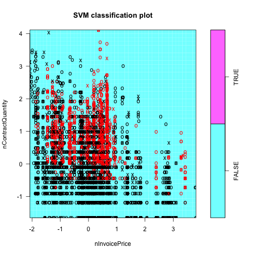

Customized Pricing v5 analysis
========================================================

Initilize R environment
-------------------------

Set language and load relevant packages.

```r
Sys.setenv(LANG = "en")

require("plyr")
require("ggplot2")
```


Preparing data for analysis
---------------------------

First set the working directory [NOTE: you need to modify the path below to the actual folder having the data file]. Then read the csv data files and have a quick look

```r
#NEED TO FIRST SET R WORKING DIRECTORY TO WHERE THE FILES ARE LOCATED!!!
#setwd("~/PATH/TO/DATA/FILE")

load("../data/data.v5.masked.Training.RData")
load("../data/data.v5.masked.Validation.RData")

head(dataT, n=10)
```

```
      PricingDate     Product      Customer    Channel     Territory ContractQuantity InvoicePrice InvoiceAmount NetPrice NetAmount Discount isDiscount
23398   11-OCT-12 Product_123  Customer_755  Channel_7  Territory_32                1        35.29         35.29    35.29     35.29   0.0000      FALSE
1377    27-DEC-12  Product_88 Customer_1726  Channel_8 Territory_111               20        21.70        434.00    21.70    434.00   0.0000      FALSE
7862    30-OCT-12 Product_104  Customer_739  Channel_4  Territory_11               30        15.00        450.00    15.00    450.00   0.0000      FALSE
7074    22-NOV-12  Product_73  Customer_367  Channel_7   Territory_1               12        18.13        217.56    18.13    217.56   0.0000      FALSE
21667   24-SEP-12  Product_52 Customer_1444 Channel_10  Territory_30               20        40.00        800.00    40.00    800.00   0.0000      FALSE
309     22-OCT-12  Product_91  Customer_767  Channel_8   Territory_6               20        20.00        400.00    20.00    400.00   0.0000      FALSE
13483   02-NOV-12 Product_130 Customer_1707  Channel_7  Territory_97               20       107.00       2140.00   107.00   2140.00   0.0000      FALSE
22501   04-SEP-12  Product_52 Customer_1262  Channel_4  Territory_23               10        40.00        400.00    40.00    400.00   0.0000      FALSE
22247   20-JUL-12  Product_25  Customer_642  Channel_7  Territory_15              150        16.55       2482.50    16.55   2482.50   0.0000      FALSE
8449    03-JUL-12   Product_8  Customer_771  Channel_7  Territory_29               14        13.90        194.60    11.91    166.74   0.1432       TRUE
      nContractQuantity nInvoicePrice
23398          -1.65494       -0.3431
1377            0.36988       -0.7797
7862            0.64393       -1.1112
7074            0.02461       -0.9410
21667           0.36988       -0.2307
309             0.36988       -0.8529
13483           0.36988        0.6527
22501          -0.09862       -0.2307
22247           1.73175       -1.0229
8449            0.12880       -1.1795
```


Visualize the Training data set:
- distribution of *Discount* (taken out those cases with 0 discount)

```r
hist(dataT[dataT$isDiscount,]$Discount, breaks=50)
```

 


- plot *Discount* as a function of *nContractQuantity*, colored by *Channel*

```r
qplot(x=nContractQuantity, y=Discount, colour=Channel, data=dataT)
```

 


Analysis Step 1. Classification
--------------------------------
To predict whom not to offer any discount. Here we will test multiple classification tools using the **Training** dataset: logistic regression, decision tree, random forest, and SVM, and choose the best.

# 1. logistic regression without using *Territory* variable.

- Setup and train the model

```r
logistic1.model <- glm(isDiscount ~ nContractQuantity + nInvoicePrice + Channel, data=dataT, family=binomial())

summary(logistic1.model)
```

```

Call:
glm(formula = isDiscount ~ nContractQuantity + nInvoicePrice + 
    Channel, family = binomial(), data = dataT)

Deviance Residuals: 
   Min      1Q  Median      3Q     Max  
-3.214  -0.486  -0.200   0.501   3.623  

Coefficients:
                   Estimate Std. Error z value Pr(>|z|)    
(Intercept)         -0.0814     0.8127   -0.10     0.92    
nContractQuantity    1.9692     0.0326   60.38  < 2e-16 ***
nInvoicePrice        0.7394     0.0259   28.52  < 2e-16 ***
ChannelChannel_10   -1.1294     0.8219   -1.37     0.17    
ChannelChannel_11   -0.2634     0.8162   -0.32     0.75    
ChannelChannel_2   -15.1576  2399.5449   -0.01     0.99    
ChannelChannel_3    -7.0863     1.3056   -5.43  5.7e-08 ***
ChannelChannel_4     0.2501     0.8136    0.31     0.76    
ChannelChannel_5    -6.2129     0.8818   -7.05  1.8e-12 ***
ChannelChannel_6   -19.7601   140.7232   -0.14     0.89    
ChannelChannel_7    -0.7086     0.8133   -0.87     0.38    
ChannelChannel_8    -3.7212     0.8164   -4.56  5.2e-06 ***
ChannelChannel_9    15.3863   548.5420    0.03     0.98    
---
Signif. codes:  0 '***' 0.001 '**' 0.01 '*' 0.05 '.' 0.1 ' ' 1

(Dispersion parameter for binomial family taken to be 1)

    Null deviance: 23956  on 19001  degrees of freedom
Residual deviance: 13368  on 18989  degrees of freedom
AIC: 13394

Number of Fisher Scoring iterations: 15
```


- Validation using the **Validation** dataset: Predict *True* if the prob > 0.5, then count accuracy using the *table* function.

```r
logistic1.valid <- dataV[c("Channel", "nContractQuantity", "nInvoicePrice", "Discount", "isDiscount")]
logistic1.valid$predP <- predict(logistic1.model, newdata=logistic1.valid, type="response")
logistic1.valid$pred1 <- logistic1.valid$predP>0.5

logistic1.table <- table(logistic1.valid$pred1, logistic1.valid$isDiscount)
logistic1.table
```

```
       
        FALSE TRUE
  FALSE  4768  806
  TRUE    649 1922
```


# 2. Logistic regression with *Territory* variable.
- Setup and train the model

```r
logistic2.model <- glm(isDiscount ~ nContractQuantity + nInvoicePrice + Channel + Territory, data=dataT, family=binomial())

summary(logistic2.model)
```

```

Call:
glm(formula = isDiscount ~ nContractQuantity + nInvoicePrice + 
    Channel + Territory, family = binomial(), data = dataT)

Deviance Residuals: 
   Min      1Q  Median      3Q     Max  
-3.416  -0.381  -0.082   0.362   4.224  

Coefficients:
                        Estimate Std. Error z value Pr(>|z|)    
(Intercept)             1.05e-01   1.02e+00    0.10   0.9182    
nContractQuantity       2.31e+00   4.12e-02   56.00  < 2e-16 ***
nInvoicePrice           9.00e-01   3.30e-02   27.32  < 2e-16 ***
ChannelChannel_10       1.03e+00   1.12e+00    0.92   0.3573    
ChannelChannel_11      -6.90e-01   9.98e-01   -0.69   0.4893    
ChannelChannel_2       -1.02e+01   6.52e+03    0.00   0.9987    
ChannelChannel_3       -8.06e+00   1.44e+00   -5.61  2.0e-08 ***
ChannelChannel_4       -4.37e-03   9.93e-01    0.00   0.9965    
ChannelChannel_5       -4.96e+00   1.21e+00   -4.11  3.9e-05 ***
ChannelChannel_6       -3.27e+01   6.73e+02   -0.05   0.9612    
ChannelChannel_7       -8.31e-02   1.00e+00   -0.08   0.9338    
ChannelChannel_8       -1.85e+00   1.14e+00   -1.63   0.1034    
ChannelChannel_9        1.67e+01   1.46e+03    0.01   0.9908    
TerritoryTerritory_10   5.48e-01   3.27e-01    1.68   0.0932 .  
TerritoryTerritory_100 -2.03e+01   1.59e+03   -0.01   0.9898    
TerritoryTerritory_101 -1.77e+01   4.11e+03    0.00   0.9966    
TerritoryTerritory_102 -1.87e+01   2.12e+03   -0.01   0.9930    
TerritoryTerritory_103 -3.20e-01   3.40e-01   -0.94   0.3453    
TerritoryTerritory_104 -1.97e+01   2.60e+03   -0.01   0.9940    
TerritoryTerritory_105 -1.94e+01   8.71e+02   -0.02   0.9822    
TerritoryTerritory_106  8.72e+00   3.95e+03    0.00   0.9982    
TerritoryTerritory_107 -1.78e+01   7.72e+02   -0.02   0.9816    
TerritoryTerritory_108 -1.95e+00   4.80e-01   -4.07  4.7e-05 ***
TerritoryTerritory_109 -2.04e+01   1.62e+03   -0.01   0.9900    
TerritoryTerritory_11  -1.65e-01   3.38e-01   -0.49   0.6261    
TerritoryTerritory_110  7.23e-01   7.42e-01    0.97   0.3301    
TerritoryTerritory_111 -5.20e+00   6.65e-01   -7.81  5.7e-15 ***
TerritoryTerritory_112 -1.32e+00   5.67e-01   -2.33   0.0199 *  
TerritoryTerritory_113 -1.06e+00   7.44e-01   -1.43   0.1527    
TerritoryTerritory_12  -1.35e+00   6.60e-01   -2.05   0.0407 *  
TerritoryTerritory_13   1.21e+01   6.56e+03    0.00   0.9985    
TerritoryTerritory_14   1.32e-01   3.19e-01    0.42   0.6779    
TerritoryTerritory_15  -6.83e+00   4.43e-01  -15.41  < 2e-16 ***
TerritoryTerritory_16   2.61e-01   3.42e-01    0.76   0.4450    
TerritoryTerritory_17   2.63e-01   3.32e-01    0.79   0.4270    
TerritoryTerritory_18  -1.68e+01   1.14e+03   -0.01   0.9883    
TerritoryTerritory_19  -6.99e-01   2.47e-01   -2.83   0.0047 ** 
TerritoryTerritory_2   -1.22e+00   3.85e-01   -3.18   0.0015 ** 
TerritoryTerritory_20  -1.84e+01   3.16e+03   -0.01   0.9954    
TerritoryTerritory_21   2.67e-02   3.60e-01    0.07   0.9410    
TerritoryTerritory_22   1.12e-01   3.15e-01    0.36   0.7217    
TerritoryTerritory_23   1.77e-01   2.91e-01    0.61   0.5439    
TerritoryTerritory_24  -1.68e+01   2.41e+03   -0.01   0.9944    
TerritoryTerritory_25   4.15e-01   2.72e-01    1.53   0.1272    
TerritoryTerritory_26   4.61e-01   2.83e-01    1.63   0.1040    
TerritoryTerritory_27   4.51e-01   2.82e-01    1.60   0.1089    
TerritoryTerritory_28  -4.24e-01   2.42e-01   -1.75   0.0805 .  
TerritoryTerritory_29  -1.27e-01   2.39e-01   -0.53   0.5955    
TerritoryTerritory_3   -1.73e+00   6.11e-01   -2.83   0.0046 ** 
TerritoryTerritory_30  -2.54e+00   6.43e-01   -3.96  7.6e-05 ***
TerritoryTerritory_31  -2.88e-01   2.51e-01   -1.15   0.2500    
TerritoryTerritory_32  -2.62e+00   2.51e-01  -10.44  < 2e-16 ***
TerritoryTerritory_33  -3.37e-02   2.52e-01   -0.13   0.8935    
TerritoryTerritory_34   1.45e-01   3.27e-01    0.44   0.6579    
TerritoryTerritory_35  -3.40e-01   2.43e-01   -1.40   0.1610    
TerritoryTerritory_36  -1.47e+01   1.13e+03   -0.01   0.9896    
TerritoryTerritory_37   5.28e-01   5.05e-01    1.05   0.2953    
TerritoryTerritory_38  -2.67e-01   2.37e-01   -1.13   0.2600    
TerritoryTerritory_39  -4.44e-01   3.25e-01   -1.36   0.1723    
TerritoryTerritory_4   -1.86e+01   1.61e+03   -0.01   0.9908    
TerritoryTerritory_40   1.01e+00   4.56e-01    2.22   0.0265 *  
TerritoryTerritory_41  -1.78e+01   6.57e+02   -0.03   0.9784    
TerritoryTerritory_42  -1.94e+01   6.39e+02   -0.03   0.9757    
TerritoryTerritory_43   1.00e+01   1.49e+03    0.01   0.9947    
TerritoryTerritory_44   1.17e+01   1.94e+03    0.01   0.9952    
TerritoryTerritory_45  -1.71e+00   6.13e-01   -2.80   0.0051 ** 
TerritoryTerritory_46  -1.71e+01   1.89e+03   -0.01   0.9928    
TerritoryTerritory_47  -1.76e+01   4.52e+03    0.00   0.9969    
TerritoryTerritory_48  -1.82e+01   3.71e+03    0.00   0.9961    
TerritoryTerritory_49   6.19e-01   3.35e-01    1.85   0.0647 .  
TerritoryTerritory_5   -1.62e+00   6.34e-01   -2.56   0.0105 *  
TerritoryTerritory_50  -2.64e+00   6.26e-01   -4.21  2.6e-05 ***
TerritoryTerritory_51  -1.65e+01   7.30e+02   -0.02   0.9819    
TerritoryTerritory_52   4.85e-01   3.72e-01    1.31   0.1915    
TerritoryTerritory_53  -2.09e-01   3.22e-01   -0.65   0.5167    
TerritoryTerritory_54   2.27e-01   3.02e-01    0.75   0.4528    
TerritoryTerritory_55  -3.31e+00   1.32e+00   -2.51   0.0120 *  
TerritoryTerritory_56  -1.76e+01   1.86e+03   -0.01   0.9925    
TerritoryTerritory_57  -4.43e+00   7.07e-01   -6.27  3.7e-10 ***
TerritoryTerritory_58  -1.93e+01   6.42e+02   -0.03   0.9760    
TerritoryTerritory_59  -1.76e+01   1.82e+03   -0.01   0.9923    
TerritoryTerritory_6   -1.72e+01   9.56e+02   -0.02   0.9856    
TerritoryTerritory_60   9.04e+00   1.47e+03    0.01   0.9951    
TerritoryTerritory_61  -1.89e+01   6.17e+02   -0.03   0.9755    
TerritoryTerritory_62  -1.84e+01   1.95e+03   -0.01   0.9924    
TerritoryTerritory_63   7.05e-01   3.96e-01    1.78   0.0751 .  
TerritoryTerritory_64   1.32e+01   1.97e+03    0.01   0.9947    
TerritoryTerritory_65  -1.75e+01   6.10e+02   -0.03   0.9770    
TerritoryTerritory_66  -1.77e+01   7.49e+02   -0.02   0.9811    
TerritoryTerritory_67   3.31e-02   3.44e-01    0.10   0.9234    
TerritoryTerritory_68  -2.29e+00   9.97e-01   -2.29   0.0217 *  
TerritoryTerritory_69  -1.85e+01   5.38e+02   -0.03   0.9725    
TerritoryTerritory_7   -1.72e+01   6.52e+03    0.00   0.9979    
TerritoryTerritory_70  -2.26e+00   7.77e-01   -2.91   0.0036 ** 
TerritoryTerritory_71  -3.88e-01   4.93e-01   -0.79   0.4314    
TerritoryTerritory_72   7.22e-01   5.65e-01    1.28   0.2011    
TerritoryTerritory_73  -1.84e+01   1.22e+03   -0.02   0.9880    
TerritoryTerritory_74  -4.58e+00   1.14e+00   -4.01  6.0e-05 ***
TerritoryTerritory_75  -1.64e+00   5.71e-01   -2.88   0.0040 ** 
TerritoryTerritory_76   1.21e+01   6.56e+03    0.00   0.9985    
TerritoryTerritory_77   1.33e+01   1.63e+03    0.01   0.9935    
TerritoryTerritory_78   6.99e-01   4.25e-01    1.64   0.1002    
TerritoryTerritory_79   4.59e-01   3.55e-01    1.30   0.1953    
TerritoryTerritory_8   -3.65e-01   5.44e-01   -0.67   0.5020    
TerritoryTerritory_80   1.13e+01   2.48e+03    0.00   0.9964    
TerritoryTerritory_81  -1.71e+01   2.89e+03   -0.01   0.9953    
TerritoryTerritory_82   7.07e-02   3.40e-01    0.21   0.8354    
TerritoryTerritory_83   1.31e+01   1.70e+03    0.01   0.9939    
TerritoryTerritory_84   7.26e+00   6.56e+03    0.00   0.9991    
TerritoryTerritory_85  -1.80e+01   7.64e+02   -0.02   0.9812    
TerritoryTerritory_86  -1.57e+01   6.52e+03    0.00   0.9981    
TerritoryTerritory_87  -1.73e+01   1.51e+03   -0.01   0.9908    
TerritoryTerritory_88   2.61e-01   3.26e-01    0.80   0.4228    
TerritoryTerritory_89  -1.98e+01   2.97e+03   -0.01   0.9947    
TerritoryTerritory_9   -8.02e-01   7.71e-01   -1.04   0.2987    
TerritoryTerritory_90  -1.48e+00   6.38e-01   -2.31   0.0208 *  
TerritoryTerritory_91   2.01e-01   3.77e-01    0.53   0.5938    
TerritoryTerritory_92   3.95e-01   2.55e-01    1.55   0.1219    
TerritoryTerritory_93  -1.80e+01   6.91e+02   -0.03   0.9792    
TerritoryTerritory_94  -1.29e+00   6.40e-01   -2.02   0.0435 *  
TerritoryTerritory_95   1.13e+01   4.92e+02    0.02   0.9816    
TerritoryTerritory_96  -1.81e+01   3.13e+03   -0.01   0.9954    
TerritoryTerritory_97   1.73e-01   2.88e-01    0.60   0.5478    
TerritoryTerritory_98  -1.74e+01   7.97e+02   -0.02   0.9826    
TerritoryTerritory_99  -1.62e+00   8.44e-01   -1.92   0.0544 .  
---
Signif. codes:  0 '***' 0.001 '**' 0.01 '*' 0.05 '.' 0.1 ' ' 1

(Dispersion parameter for binomial family taken to be 1)

    Null deviance: 23956  on 19001  degrees of freedom
Residual deviance: 10956  on 18877  degrees of freedom
AIC: 11206

Number of Fisher Scoring iterations: 17
```


- Validation using the **Validation** dataset: Predict *True* if the prob > 0.5, then count accuracy using the *table* function.

```r
logistic2.valid <- dataV[c("Channel", "Territory", "nContractQuantity", "nInvoicePrice", "Discount", "isDiscount")]
logistic2.valid$predP <- predict(logistic2.model, newdata=logistic2.valid, type="response")
logistic2.valid$pred1 <- logistic2.valid$predP>0.5

logistic2.table <- table(logistic2.valid$pred1, logistic2.valid$isDiscount)
logistic2.table
```

```
       
        FALSE TRUE
  FALSE  4876  501
  TRUE    541 2227
```


- Plot the ROC and accuracy curves.

```r
require(ROCR)
logistic2.pred <- prediction(logistic2.valid$predP, logistic2.valid$isDiscount)
# Plot ROC curve
logistic2.ROC <- performance(logistic2.pred, measure = "tpr", x.measure = "fpr")
plot(logistic2.ROC)
```

 

```r
# Plot precision/recall curve
#logistic2.precision <- performance(logistic2.pred, measure = "prec", x.measure = "rec")
#plot(logistic2.precision)
# Plot accuracy as function of threshold
logistic2.accuracy <- performance(logistic2.pred, measure = "acc")
plot(logistic2.accuracy)
```

 


# 3. Decision tree using the *rpart* package.
- Setup and train the model, then print summary.

```r
require("rpart")
tree2.model <- rpart(as.factor(isDiscount) ~ nContractQuantity + nInvoicePrice + Channel + Territory, data=dataT)
summary(tree2.model)
```

```
Call:
rpart(formula = as.factor(isDiscount) ~ nContractQuantity + nInvoicePrice + 
    Channel + Territory, data = dataT)
  n= 19002 

      CP nsplit rel error xerror     xstd
1 0.3284      0    1.0000 1.0000 0.010462
2 0.0137      2    0.3431 0.3438 0.007035
3 0.0100      8    0.2337 0.2368 0.005952

Variable importance
nContractQuantity         Territory           Channel     nInvoicePrice 
               31                31                20                19 

Node number 1: 19002 observations,    complexity param=0.3284
  predicted class=FALSE  expected loss=0.3247  P(node) =1
    class counts: 12832  6170
   probabilities: 0.675 0.325 
  left son=2 (9275 obs) right son=3 (9727 obs)
  Primary splits:
      nContractQuantity < -0.06641  to the left,  improve=2781.0, (0 missing)
      Territory         splits as  LRLLLRLLLLLLRRLRLLLRLRRLLLLRRRLRRRRLRRRLRRRLRRRLRLLLLLLLLRLLLRRRLLLLLLLLLRLLLRRLLLRRLLRLLRRRLLRLLLLLRLLLRRLLLLRLL, improve=2033.0, (0 missing)
      Channel           splits as  RLRLLRLLLLR, improve=1233.0, (0 missing)
      nInvoicePrice     < 0.9469    to the right, improve= 293.6, (0 missing)
  Surrogate splits:
      Territory     splits as  LRLLLRLLRRRRRLRRLLRRLRRLLLLRRRLRRRRLRRRLLRRRRLRLRLLRRLLLLRLLLRRRRRLLLLRLLRRLLRLLLRRRLRRLLRRRRLRLRLRLRLLLRRLLRLRLL, agree=0.662, adj=0.307, (0 split)
      Channel       splits as  RRRRRRRRLLR, agree=0.612, adj=0.204, (0 split)
      nInvoicePrice < 0.6726    to the right, agree=0.608, adj=0.198, (0 split)

Node number 2: 9275 observations
  predicted class=FALSE  expected loss=0.04765  P(node) =0.4881
    class counts:  8833   442
   probabilities: 0.952 0.048 

Node number 3: 9727 observations,    complexity param=0.3284
  predicted class=TRUE   expected loss=0.4111  P(node) =0.5119
    class counts:  3999  5728
   probabilities: 0.411 0.589 
  left son=6 (3132 obs) right son=7 (6595 obs)
  Primary splits:
      Territory         splits as  LR---RLLLLLLRRLRRLLRLRRLRL-RRRLRRRRRRRRLRRRLRRR-RLLLLL---RLLLRRRLLLLLLLL-RLLLRRL-LRR-LR-LRRRL-RLLLL-RL-LRRLLL-RLL, improve=1954.00, (0 missing)
      Channel           splits as  RRRLLRLLRLR, improve=1308.00, (0 missing)
      nInvoicePrice     < 0.3572    to the left,  improve= 473.30, (0 missing)
      nContractQuantity < 0.05166   to the left,  improve=  76.79, (0 missing)
  Surrogate splits:
      Channel           splits as  RRRLRRLLRLR, agree=0.885, adj=0.643, (0 split)
      nInvoicePrice     < -1.466    to the left,  agree=0.722, adj=0.136, (0 split)
      nContractQuantity < 2.386     to the right, agree=0.685, adj=0.021, (0 split)

Node number 6: 3132 observations
  predicted class=FALSE  expected loss=0.129  P(node) =0.1648
    class counts:  2728   404
   probabilities: 0.871 0.129 

Node number 7: 6595 observations,    complexity param=0.0137
  predicted class=TRUE   expected loss=0.1927  P(node) =0.3471
    class counts:  1271  5324
   probabilities: 0.193 0.807 
  left son=14 (4058 obs) right son=15 (2537 obs)
  Primary splits:
      nInvoicePrice     < 0.315     to the left,  improve=188.90, (0 missing)
      Channel           splits as  RRR-LR-LRRR, improve= 78.35, (0 missing)
      nContractQuantity < 0.9959    to the left,  improve= 69.91, (0 missing)
      Territory         splits as  -R---L------LR-LR--L-LR-L--LLR-RLRLLLLL-RRR-RRR-R--------R---RRR---------R---LR---LR--L--RRL--R-----R---RR----R--, improve= 35.35, (0 missing)
  Surrogate splits:
      nContractQuantity < -0.004792 to the right, agree=0.622, adj=0.018, (0 split)
      Territory         splits as  -L---L------LR-LL--L-LL-L--LLL-LLLLLRRL-LLL-RLL-L--------L---LRL---------L---LR---LR--L--LLL--L-----L---LL----L--, agree=0.622, adj=0.017, (0 split)
      Channel           splits as  LRL-LL-RLLR, agree=0.620, adj=0.013, (0 split)

Node number 14: 4058 observations,    complexity param=0.0137
  predicted class=TRUE   expected loss=0.2873  P(node) =0.2136
    class counts:  1166  2892
   probabilities: 0.287 0.713 
  left son=28 (169 obs) right son=29 (3889 obs)
  Primary splits:
      nInvoicePrice     < 0.2598    to the right, improve=179.10, (0 missing)
      nContractQuantity < 0.655     to the left,  improve= 88.63, (0 missing)
      Channel           splits as  RRR-LR-LRLR, improve= 36.87, (0 missing)
      Territory         splits as  -R---L------R--LR--L-RR-L--LRR-RRRLLLLL-LRR-RRR-R--------R---RLR---------R---R----LR--L--RRR--R-----R---RR----R--, improve= 36.36, (0 missing)

Node number 15: 2537 observations
  predicted class=TRUE   expected loss=0.04139  P(node) =0.1335
    class counts:   105  2432
   probabilities: 0.041 0.959 

Node number 28: 169 observations
  predicted class=FALSE  expected loss=0  P(node) =0.008894
    class counts:   169     0
   probabilities: 1.000 0.000 

Node number 29: 3889 observations,    complexity param=0.0137
  predicted class=TRUE   expected loss=0.2564  P(node) =0.2047
    class counts:   997  2892
   probabilities: 0.256 0.744 
  left son=58 (947 obs) right son=59 (2942 obs)
  Primary splits:
      nInvoicePrice     < -1.193    to the left,  improve=65.54, (0 missing)
      nContractQuantity < 0.9959    to the left,  improve=63.37, (0 missing)
      Territory         splits as  -R---L------R--LR--L-RR-L--LRR-RLRLLLLL-LRL-RLR-R--------R---RRR---------R---R----RR--L--RRR--R-----R---RR----R--, improve=49.44, (0 missing)
      Channel           splits as  RRR-LR-LRLR, improve=39.92, (0 missing)
  Surrogate splits:
      nContractQuantity < 2.157     to the right, agree=0.768, adj=0.045, (0 split)

Node number 58: 947 observations,    complexity param=0.0137
  predicted class=TRUE   expected loss=0.4182  P(node) =0.04984
    class counts:   396   551
   probabilities: 0.418 0.582 
  left son=116 (382 obs) right son=117 (565 obs)
  Primary splits:
      nInvoicePrice     < -1.257    to the right, improve=236.80, (0 missing)
      nContractQuantity < 1.118     to the left,  improve= 71.70, (0 missing)
      Territory         splits as  -R---L------R--L---L-RR-L--RRR-LLRLLLLL-LRL-RLL-R--------R---RRR---------R---R----R---R--RRR--R-----R---RR----R--, improve= 54.88, (0 missing)
      Channel           splits as  -LR-LR--LLR, improve= 35.91, (0 missing)
  Surrogate splits:
      Territory         splits as  -R---L------R--R---R-RR-L--RRR-RRRRLLLL-LRL-RLR-R--------R---RLR---------R---R----R---R--RRR--R-----R---RR----R--, agree=0.676, adj=0.196, (0 split)
      nContractQuantity < 1.002     to the left,  agree=0.671, adj=0.183, (0 split)
      Channel           splits as  -RR-RR--LRR, agree=0.615, adj=0.045, (0 split)

Node number 59: 2942 observations,    complexity param=0.0137
  predicted class=TRUE   expected loss=0.2043  P(node) =0.1548
    class counts:   601  2341
   probabilities: 0.204 0.796 
  left son=118 (1479 obs) right son=119 (1463 obs)
  Primary splits:
      nInvoicePrice     < -0.3441   to the right, improve=61.89, (0 missing)
      Channel           splits as  RRR-LR-LRLR, improve=39.86, (0 missing)
      nContractQuantity < 0.655     to the left,  improve=33.25, (0 missing)
      Territory         splits as  -R---R------L--LL--R-RR-L--LRR-RRRLRLLR-RRR-RRR-R--------R---RRR---------R---L----LR--L--RRR--R-----L---RR----R--, improve=22.60, (0 missing)
  Surrogate splits:
      Territory         splits as  -L---L------R--LL--L-RR-R--LLL-LRLRRLLR-RLL-LLR-L--------L---RLL---------L---R----RR--L--RLL--L-----R---RL----L--, agree=0.608, adj=0.212, (0 split)
      nContractQuantity < 0.6325    to the right, agree=0.575, adj=0.146, (0 split)
      Channel           splits as  LLL-LL-RRLL, agree=0.565, adj=0.126, (0 split)

Node number 116: 382 observations
  predicted class=FALSE  expected loss=0.1518  P(node) =0.0201
    class counts:   324    58
   probabilities: 0.848 0.152 

Node number 117: 565 observations
  predicted class=TRUE   expected loss=0.1274  P(node) =0.02973
    class counts:    72   493
   probabilities: 0.127 0.873 

Node number 118: 1479 observations,    complexity param=0.0137
  predicted class=TRUE   expected loss=0.3063  P(node) =0.07783
    class counts:   453  1026
   probabilities: 0.306 0.694 
  left son=236 (416 obs) right son=237 (1063 obs)
  Primary splits:
      nInvoicePrice     < -0.1532   to the left,  improve=269.10, (0 missing)
      Territory         splits as  -R---R------L--LR--L-RR-L--LLR-RRRLLLRR-LRR-RRR-R--------L---RRR---------R---L----LR--L--RRR--R-----L---LR----R--, improve= 46.40, (0 missing)
      nContractQuantity < 0.655     to the left,  improve= 44.34, (0 missing)
      Channel           splits as  RRR-LR--RLR, improve= 27.20, (0 missing)
  Surrogate splits:
      Territory splits as  -R---R------R--RR--R-RR-R--RRR-RRRRRRRR-RRR-RRR-R--------R---LRR---------R---R----RR--L--RRR--R-----R---RR----R--, agree=0.721, adj=0.01, (0 split)

Node number 119: 1463 observations
  predicted class=TRUE   expected loss=0.1012  P(node) =0.07699
    class counts:   148  1315
   probabilities: 0.101 0.899 

Node number 236: 416 observations
  predicted class=FALSE  expected loss=0.2115  P(node) =0.02189
    class counts:   328    88
   probabilities: 0.788 0.212 

Node number 237: 1063 observations
  predicted class=TRUE   expected loss=0.1176  P(node) =0.05594
    class counts:   125   938
   probabilities: 0.118 0.882 
```

```r
printcp(tree2.model)
```

```

Classification tree:
rpart(formula = as.factor(isDiscount) ~ nContractQuantity + nInvoicePrice + 
    Channel + Territory, data = dataT)

Variables actually used in tree construction:
[1] Territory         nContractQuantity nInvoicePrice    

Root node error: 6170/19002 = 0.32

n= 19002 

     CP nsplit rel error xerror  xstd
1 0.328      0      1.00   1.00 0.010
2 0.014      2      0.34   0.34 0.007
3 0.010      8      0.23   0.24 0.006
```

```r
plotcp(tree2.model)
```

 


- plot the tree

```r
plot(tree2.model, uniform=TRUE, main="Regression Tree for Mileage ")
text(tree2.model, use.n=TRUE, all=TRUE)
```

 


- validation

```r
tree2.valid <- dataV[c("Channel", "Territory", "nContractQuantity", "nInvoicePrice", "Discount", "isDiscount")]
tree2.valid$predP <- predict(tree2.model, newdata=tree2.valid, type="prob")[,"TRUE"]
tree2.valid$pred1 <- as.logical(predict(tree2.model, newdata=tree2.valid, type="class"))

tree2.table <- table(tree2.valid$pred1, tree2.valid$isDiscount)
tree2.table
```

```
       
        FALSE TRUE
  FALSE  5196  466
  TRUE    221 2262
```


- plot ROC.

```r
require(ROCR)
tree2.pred <- prediction(tree2.valid$predP, tree2.valid$isDiscount)
# Plot ROC curve
tree2.ROC <- performance(tree2.pred, measure = "tpr", x.measure = "fpr")
plot(tree2.ROC)
```

 

```r
# Plot precision/recall curve
#tree2.precision <- performance(tree2.pred, measure = "prec", x.measure = "rec")
#plot(tree2.precision)
# Plot accuracy as function of threshold
tree2.accuracy <- performance(tree2.pred, measure = "acc")
plot(tree2.accuracy)
```

 


# 4. Random Forest prediction of isDiscount
- Train model and summary result. 

```r
library(randomForest)
forest1.model <- randomForest(as.factor(isDiscount) ~ nContractQuantity  + nInvoicePrice + Channel, data=dataT)
summary(forest1.model)
```

```
                Length Class  Mode     
call                3  -none- call     
type                1  -none- character
predicted       19002  factor numeric  
err.rate         1500  -none- numeric  
confusion           6  -none- numeric  
votes           38004  matrix numeric  
oob.times       19002  -none- numeric  
classes             2  -none- character
importance          3  -none- numeric  
importanceSD        0  -none- NULL     
localImportance     0  -none- NULL     
proximity           0  -none- NULL     
ntree               1  -none- numeric  
mtry                1  -none- numeric  
forest             14  -none- list     
y               19002  factor numeric  
test                0  -none- NULL     
inbag               0  -none- NULL     
terms               3  terms  call     
```

```r
print(forest1.model) # view results 
```

```

Call:
 randomForest(formula = as.factor(isDiscount) ~ nContractQuantity +      nInvoicePrice + Channel, data = dataT) 
               Type of random forest: classification
                     Number of trees: 500
No. of variables tried at each split: 1

        OOB estimate of  error rate: 4.6%
Confusion matrix:
      FALSE TRUE class.error
FALSE 12373  459     0.03577
TRUE    415 5755     0.06726
```

```r
importance(forest1.model) #importance of each predictor
```

```
                  MeanDecreaseGini
nContractQuantity             2976
nInvoicePrice                 1643
Channel                       1645
```

```r
plot(forest1.model)
```

 


- Validation

```r
forest1.valid <- dataV[c("Channel", "nContractQuantity", "nInvoicePrice", "Discount", "isDiscount")]
forest1.valid$predP <- predict(forest1.model, newdata=forest1.valid, type="prob")[,"TRUE"]
forest1.valid$pred1 <- as.logical(predict(forest1.model, newdata=forest1.valid, type="response"))

forest1.table <- table(forest1.valid$pred1, forest1.valid$isDiscount)
forest1.table
```

```
       
        FALSE TRUE
  FALSE  5206  203
  TRUE    211 2525
```


- Plot ROC.

```r
require(ROCR)
forest1.pred <- prediction(forest1.valid$predP, forest1.valid$isDiscount)
# Plot ROC curve
forest1.ROC <- performance(forest1.pred, measure = "tpr", x.measure = "fpr")
plot(forest1.ROC)
```

 

```r
# Plot precision/recall curve
#forest1.precision <- performance(forest1.pred, measure = "prec", x.measure = "rec")
#plot(forest1.precision)
# Plot accuracy as function of threshold
forest1.accuracy <- performance(forest1.pred, measure = "acc")
plot(forest1.accuracy)
```

 


# 5. SVM classification
- Train SVM

```r
require(e1071)

## first-time run of SVM requires optimization of parameters gamma and cost
#svm.tune <- tune.svm(as.factor(isDiscount) ~ nContractQuantity  + nInvoicePrice + Channel + Territory, data = dataT, validation.x=dataV, gamma = 2^(-1:5), cost = 10^(1:4), probability=TRUE)
#svm.model <- svm.tune$best.model

## directly use the obtained optimal parameter gamma=8, cost=10000
svm.model <- svm(as.factor(isDiscount) ~ nContractQuantity  + nInvoicePrice + Channel + Territory, data = dataT, cost = 10000, gamma = 8, probability=TRUE)
summary(svm.model)
```

```

Call:
svm(formula = as.factor(isDiscount) ~ nContractQuantity + nInvoicePrice + Channel + Territory, data = dataT, cost = 10000, gamma = 8, 
    probability = TRUE)


Parameters:
   SVM-Type:  C-classification 
 SVM-Kernel:  radial 
       cost:  10000 
      gamma:  8 

Number of Support Vectors:  5226

 ( 3211 2015 )


Number of Classes:  2 

Levels: 
 FALSE TRUE
```


- Validation

```r
svm.valid <- dataV[c("Channel", "Territory", "nContractQuantity", "nInvoicePrice", "Discount", "isDiscount")]
svm.valid$pred1 <- as.logical(predict(svm.model, newdata=svm.valid))
svm.valid$predP <- attr(predict(svm.model, newdata=svm.valid, probability=TRUE), "probabilities")[,"TRUE"]

svm.table <- table(svm.valid$pred1, svm.valid$isDiscount)
svm.table
```

```
       
        FALSE TRUE
  FALSE  5243  219
  TRUE    174 2509
```


- Plot ROC

```r
require(ROCR)
svm.pred <- prediction(svm.valid$predP, svm.valid$isDiscount)
# Plot ROC curve
svm.ROC <- performance(svm.pred, measure = "tpr", x.measure = "fpr")
plot(svm.ROC)
```

 

```r
# Plot precision/recall curve
#svm.precision <- performance(svm.pred, measure = "prec", x.measure = "rec")
#plot(svm.precision)
# Plot accuracy as function of threshold
svm.accuracy <- performance(svm.pred, measure = "acc")
plot(svm.accuracy)
```

 


- Visualize the SVM model

```r
plot(svm.model, data = dataV, formula = nContractQuantity ~ nInvoicePrice)
```

 


